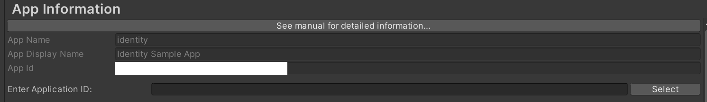
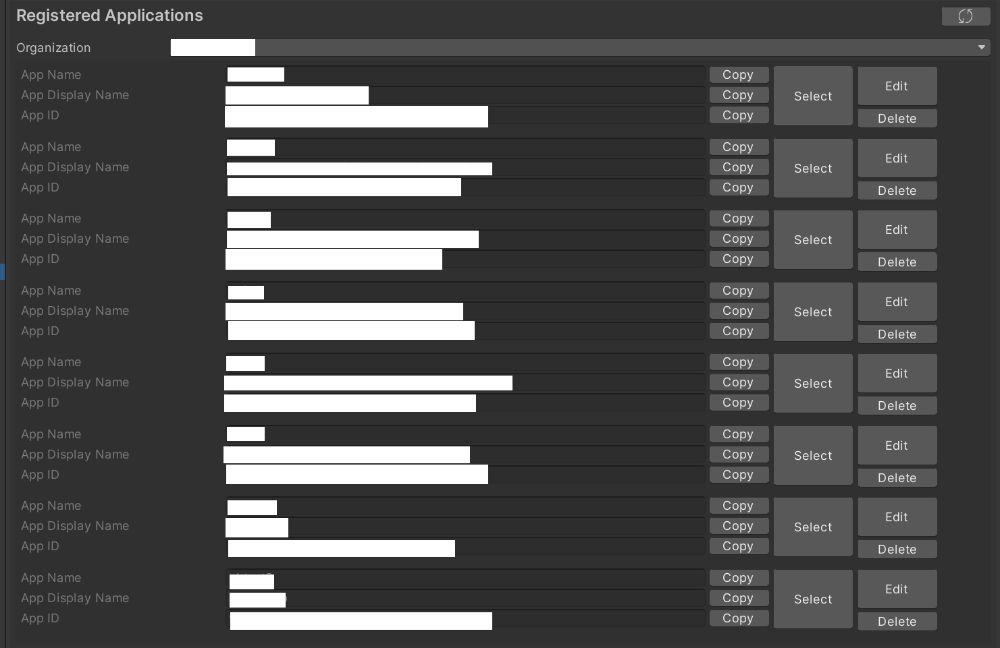
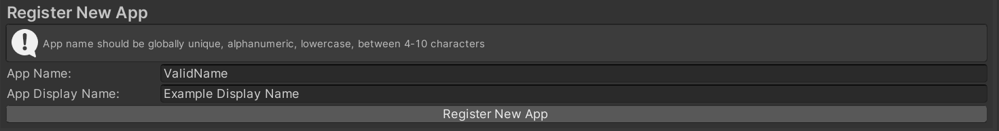

# Get started

This getting started guide outlines the basics of setting up a Project with Unity Cloud Identity.

## Install the package

To install Unity Cloud Identity on a new or existing Unity Project, install the Identity package using the [installation instructions](installation.md).

## Register an application in the Unity Cloud platform

Unity Cloud Projects require an application identifier when you build the application. The application identifier identifies your application in the Unity Cloud services and also enables the custom URI scheme association with the OS that's used in Unity Deep Linking and login operations.

### Create an application identifier

To set up the application identifier manually, follow these steps:

1. Open your application project in the Unity Editor.
2. Go to **Edit > Project Settings > Unity Cloud > App Information**.
3. In the **Enter Application ID** field, enter your application identifier.

4. To update the application data, click **Select**.

### Select, edit, and delete an existing application

If the `com.unity.cloud.identity` package is properly installed and you are logged in the Editor with the corresponding account, you can access existing applications.

Once logged in, follow these steps:

1. Open your application project in the Unity Editor.
2. Go to **Edit > Project Settings > Unity Cloud > App Information**.
3. Select your Organization from the **Organization** dropdown list. The list of your existing registered applications appears.

You can select, edit, or delete an existing application from this list:

* To select an application, click the **Select** button. This action updates the application data for the project.
* To edit an application, click the **Edit** button. This action opens a window that lets you edit the `App Name` and `App ID` values.

* To delete an application, click the **Delete** button. This action opens a window to confirm the deletion. Once deleted, you cannot recover the application.

### Register a new application

If the `com.unity.cloud.identity` package is properly installed and you are logged in the Editor with the corresponding account, you can access existing applications.

Once logged in, follow these steps:

1. Open your application project in the Unity Editor.
2. Go to **Edit > Project Settings > Unity Cloud > App Information**.
3. Select your Organization from the **Organization** dropdown list. Below the list of registered applications, the option to register a new app appears.

1. To register a new application, enter the desired app name and app display name in the **App Name** and **App Display Name** fields. 
> **Note**: The app name must be unique, alphanumeric, in lowercase, and between 4 to 10 characters long.
1. Click **Select** to register the new application. When successfully registered, the local application data will also be updated.

  Your Project is now set up.

## Troubleshooting

Refer to the [troubleshooting](troubleshooting.md#getting-started-issues) section if you have trouble getting started with your Project.
