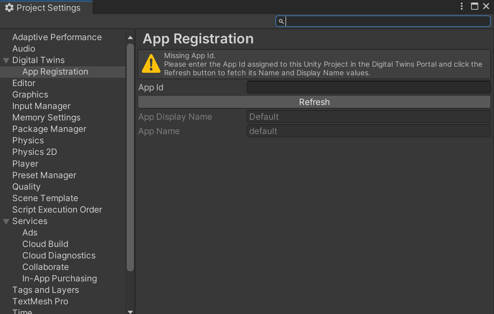

# Get started

This getting started guide outlines the basics of setting up a project with Unity Cloud Identity.

## Install the package

To install Unity Cloud Identity on a new or existing Unity project, install the Identity package using the [installation instructions](installation.md).

## Register an application in the Unity Cloud platform

Unity Cloud projects require an application identifier when you build the application. The application identifier identifies your application in the Unity Cloud services and also enables the custom URI scheme association with the OS that's used in Unity Cloud Deep Linking and login operations.

### Create an application identifier

To create an application identifier, follow these steps:

1. Log into the [Unity Cloud Portal](https://dashboard.unity3d.com/digital-twins/).
2. Select **Developer Hub**> **Registered Applications**.
3. Select the **+Register an application** button and follow instructions to fill the form.

> **Note:** The URLs must be slightly adapted if you want to generate an API token on a different service environment than production.

### Set up the application identifier

To set up the application identifier, follow these steps:

1. Open your application project in the Unity Editor.
2. Go to **Edit > Project Settings > Unity Cloud > App Registration**.
3. Enter your application identifier in the **App Id** field.

4. Select **Refresh** to update the application data in the Unity Cloud Portal.
  Your project is now set up.

## Manage the package stripping level

To avoid runtime errors when building with this package, follow these steps:

1. In your Unity project window, go to **Edit** > **Project settings**.   The Project setting window opens.
2. Select the **Player** option.
3. Scroll to the **Additional Compiler Arguments** section.
4. Set the **Managed stripping level** option to:

- **Disabled**
  or
- **Minimal** (if the **Disabled** option isn't available)

## Supported platforms

- Unity Editor
- Windows Standalone
- [WebGL](use-case-testing-webgl-localhost.md)
- Android
- Linux
- MacOS 
- iOS: Requires an Xcode project build and a valid development build certificate to achieve binding for the custom URI scheme at the OS level.