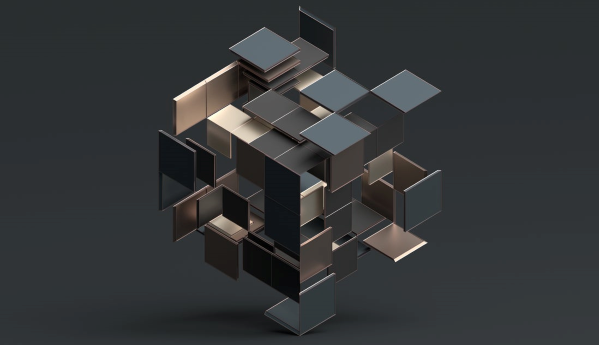

# Unity Cloud Identity

Unity Cloud Identity and web services provide end-to-end authentication and access control for securing your assets.

Controlling access to 3D data is time consuming and specific to the existing Identity and Access Management policies of your business. Developers often struggle to configure authentication services in a way that scales with their RT3D solution.

Unity Cloud Identity package and services let you control access to your asset viewer and data with your existing IAM solutions.
