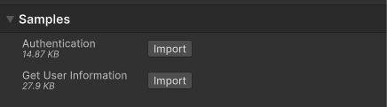

# Sample: UnityEditorServiceAuthorizer sample

The UnityEditorServiceAuthorizer sample demonstrates how you can use the `UnityEditorServiceAuthorizer.instance` in an `EditorWindow` to fetch information about the user currently signed in to the Unity Editor.

Read more about the [`UnityEditorServiceAuthorizer` class](unity-editor-service-authorizer.md).

## Before you start

Before you can use the UnityEditorServiceAuthorizer sample, make sure you have the following:

* An installed [Identity](installation.md) package.
* A valid [Unity ID Account](https://id.unity.com/).

## Install the sample

To install the sample, follow these steps:

1. In the Unity Editor, go to **Window** > **Package Manager** > **Unity Cloud Identity**.
2. Expand the **Samples** section.
3. Select **Import** next to `UnityEditorServiceAuthorizer`.

   

 4.  After the import process completes, you can view the imported assets under the `Assets/Samples/Unity Cloud Identity` folder.

## Run the sample

To run the sample, follow these steps:

1. In the Unity Editor, go to **Unity Cloud** > **Samples** and select the **UnityEditorServiceAuthorizer Sample** menu item.
2. Your username displays in a Label GUILayout element inside a custom `EditorWindow`.

#### UnityCloudIdentityWindow script

The `UnityCloudIdentityWindow` class uses the `UnityEditorServiceAuthorizer.instance` as an `IUserInfoProvider` to retrieve information about the user currently signed in to the Unity Editor.

The `AuthenticationStateChanged` event of the `UnityEditorServiceAuthorizer.instance` is registered in the `OnEnable` method and unregistered in the `OnDisable` method of the script. When a user signs in, the `AuthenticationStateChanged` event handler triggers the `IUserInfoProvider.GetUserInfoAsync()` method to fetch the username of the user currently signed in to the Unity Editor.

>[!NOTE]
>The `AuthenticationState` class updates when the Unity Editor launches and whenever a user signs in or out from the Unity Editor.

To open the UnityCloudIdentityWindow script, go to the `Assets/Samples/Unity Cloud Identity/<package-version>/UnityEditorServiceAuthorizer/Scripts/UnityCloudIdentityWindow.cs` file.

## Troubleshooting

In case of issues with the UnityEditorServiceAuthorizer sample, refer to [troubleshooting](troubleshooting.md#sample-issues).
