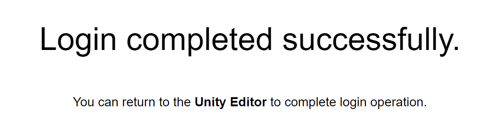

# Samples | Integrate Identity samples in a Unity project

You can use the Identity samples to retrieve a valid access token for a user and manage UI states. <li>The Authentication sample outlines how to listen to Authentication state changes in your application to manage the visibility and interactabilty of GameObjects.</li>
<li>The [Get User Information](use-case-getting-user-information.md) sample outlines how to use an access token to retrieve information about the user.</li>

## Prerequisites

To use the Identity samples, you require the following:

* An installed [Identity](installation.md) package
* A valid [Unity ID](https://id.unity.com/)

### Main components for the Identity package samples

This section describes the scripts shared in all Identity package samples.

#### Platform Services script

The `PlatformServices` class uses the `CompositeAuthenticatorSettingsBuilder` to build a list of default `IAuthenticator` implementations to cover concurrent authentication flow and assign it to a `CompositeAuthenticator`.

The `PlatformServices` class has two accompanying classes called `PlatformServicesInitialization` and `PlatformServicesShutdown` that call the initialization and shutdown methods through Unity's standard `Monobehaviour` methods `Awake()`, `Start()` and `OnDestroy()`.

To open the Platform Services script, go to the `Assets/Samples/Unity Cloud Identity/<package-version>/Shared/Scripts/PlatformServices.cs` file.

#### UI Controller script

The `UIController` class manages the visibility and interactability of GameObjects based on the `AuthenticationState` and the `RequiresGUI` properties of the `ICompositeAuthenticator`.

The `UIController` gets a reference to an `ICompositeAuthenticator` and a `IAuthenticationStateProvider` and exposes an `AuthenticationStateChanged` event. The `UIController` uses the `AuthenticationStateChanged` event to update the visibility and interactability of GameObjects.

To open the UI Controller script, go to the `Assets/Samples/Unity Cloud Identity/<package-version>/Shared/Scripts/UIController/UIController.cs` file.

#### Active User Controller script

The `ActiveUserController` class manages the authentication of a user.

The `ActiveUserController` gets a reference to an `ICompositeAuthenticator`, which calls the login and logout methods and exposes an `AuthenticationStateChanged` event. The `ActiveUserController` uses the `AuthenticationStateChanged` event to update the state of the UI.

To open the Active User Controller script, go to the `Assets/Samples/Unity Cloud Identity/<package-version>/Shared/Scripts/UIController/ActiveUserController.cs` file.

## Authentication sample

The Authentication sample outlines the different authentication states an application is required to handle in an interactive user login flow.

### Installation of Authentication

To install the sample, follow these steps:

1. In your Unity project, go to **Window** > **Package Manager** > **Unity Cloud Identity**.
2. Expand **Samples** and select **Import** beside the Authentication sample.

   

   After the import process completes, you can view the imported assets under the `Assets/Samples/Unity Cloud Identity` folder.

### Run the Authentication sample

To run the sample, follow these steps:

1. In your Unity project, go to **File** > **Open Scene**.
2. Go to `Assets/Samples/Unity Cloud Identity/<package-version>/Authentication/Scenes/AuthenticationSample.unity` and run the scene.
3. In the Game view, select **Login** if you are logged out.
4. Log into the browser window that launches with your Unity ID account.
5. Return to the sample scene to confirm that you are logged in.

    > **Note:** Your device stores a refresh token until you log out. This token lets the Identity service automatically attempt to log you in when you relaunch the sample.

6. (Optional) Relaunch the sample, without logging out, to test the automatic login.

#### AuthenticationState Updater script

The `AuthenticationStateUpdater` class manages the authentication state of a user.

The `AuthenticationStateUpdater` gets a reference to an `IAuthenticationStateProvider` and exposes an `AuthenticationStateChanged` event. The `AuthenticationStateUpdater` uses the `AuthenticationStateChanged` event to update the state of the UI.

To open the Active User controller script, go to the `Assets/Samples/Unity Cloud Identity/<package-version>/Authentication/Scripts/AuthenticationStateUpdater.cs` file.

## Get User Information sample

The Get User Information sample outlines how to use the Identity service to retrieve information about a logged-in user.

### Installation of Get User Information

To install the sample, follow these steps:

1. In your Unity project, go to **Window** > **Package Manager** > **Unity Cloud Identity**.
2. Expand **Samples** and select **Import** beside the Get User Information sample.
   After the import process completes, you can view the imported assets under the `Assets/Samples/Unity Cloud Identity` folder.

### Run the Get User Information sample

To run the sample, follow the [Run the Authentication sample](#run-the-authentication-sample) procedure but replace step 2 with the following: Go to `Assets/Samples/Unity Cloud Identity/<package-version>/GetUserInformation/Scenes/GetUserInfoSample.unity` and run the scene.

After you log into the sample, it displays your username along with information about how you received the access token.

#### User name updater script

The `UserNameUpdater` class handles an `IAuthenticationStateProvider` and `IUserInfoProvider`, which are initialized through the `PlatformServices` class. The `IUserInfoProvider` can retrieve the `UserInfo` for a logged in user, from which the username is retrieved. The UI then updates with the username.

To open the user name updater script, go to the `Assets/Samples/Unity Cloud Identity/<package-version>/Get User Information/Scripts/UserNameUpdater.cs` file.

## Troubleshoot

### The automatic browser redirection doesn't work in the Unity Editor

If you run the sample in the Unity Editor, you will see the following page after you successfully log in through your browser.

Unlike the standalone application authentication flow, where the OS prompts you to return back to your application, there is no automatic redirection to the Unity Editor. At this point, you are logged in and you can manually go back to the Unity Editor.

### Mouse input isn't registered

This sample isn't created to run with the [Input System](https://docs.unity3d.com/Packages/com.unity.inputsystem@latest) package. If you are using this package in your
project, your mouse selections may not be detected.

To fix this, set your project to support both the built-in input system and the [Input System](https://docs.unity3d.com/Packages/com.unity.inputsystem@latest) package: go to **Edit > Project Settings > Player** and set Active Input Handling to **Both**.

