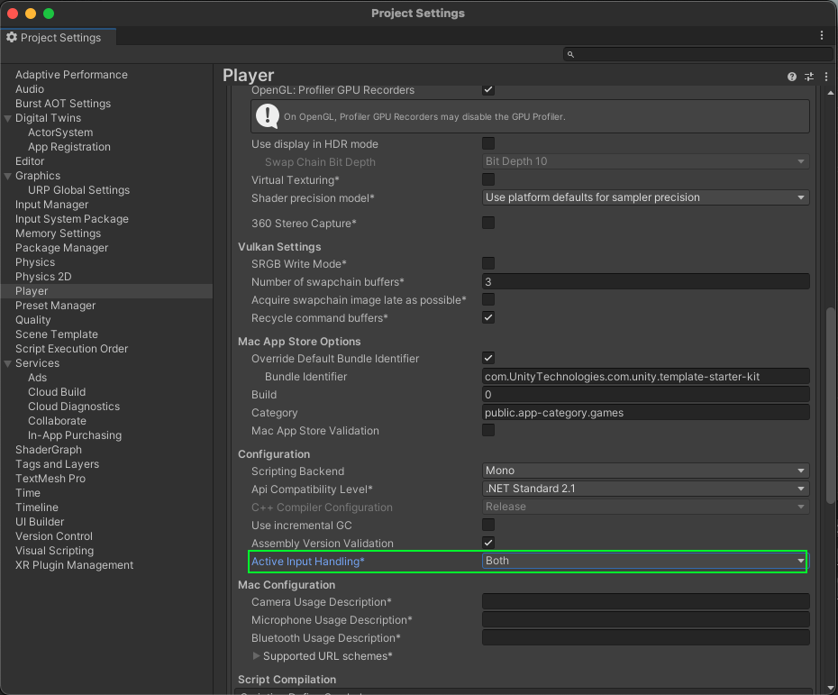

# Troubleshooting

This section describes errors or problems you might encounter when you use the Unity Cloud Identity package.

## Getting started issues

**Runtime errors appeared when building the package**

To avoid runtime errors when building with the Unity Cloud Identity package, follow these steps:

1. Open your application project in the Unity Editor.
2. Go to **Edit** > **Project settings**.
3. Select **Player**.
4. Expand **Other settings** and go to **Optimization**.
5. Set **Managed stripping level** to **Disabled**.
  
   >[!NOTE]
   >If the **Disabled** option isn't available, select **Minimal**.

## Sample issues

**Nothing happens when I select something**

The samples of the Unity Cloud Identity package aren't designed to run with the [Input System](https://docs.unity3d.com/Packages/com.unity.inputsystem@latest) package. If you use the Input System package in your Unity Editor project, Unity might not be able to detect your mouse selections.

**Solution:** Set your project to support both the built-in input system and the [Input System](https://docs.unity3d.com/Packages/com.unity.inputsystem@latest) package as follows:

1. Open your application project in the Unity Editor.
2. Go to **Edit** > **Project Settings**.
3. Select **Player**.
4. Expand **Other settings** and go to **Configuration**.
5. Set **Active Input Handling** to **Both**.

