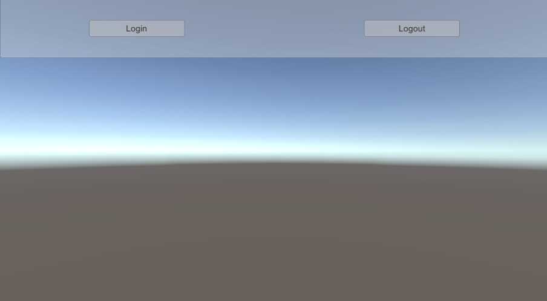

# Integrate authentication in your scene

This section explains how to set up your scene to integrate an authentication layer to communicate with Unity Cloud services.

An authentication process should retrieve an access token that identifies your application user when calling Unity Cloud services. Identity supports the following login flows to retrieve an access token:

* Interactive login flow: The default flow where the user must fill a login form through a UI in a browser.
* Automated flow: A flow recommended for automated tools. The user generates a personal access token (PAT) from the Unity Cloud Portal and injects it into the application to avoid interaction with a UI.
* Preauthenticated flow : A flow that can be used by web-hosted platforms (WebGL) where the host already has a valid access token. If a valid access token is detected, Identity skips the user login flow and directly uses it.

## Prerequisites

* Follow the [Installation instructions](installation.md).
* Follow the [Get started instructions](getting-started.md).
* Follow the [Best practices: dependency injection guide](best-practices-dependency-injection.md).

## Overview

To integrate authentication in your scene, perform the following procedures:

1. Instantiate a `CompositeAuthenticator` in `PlatformServices`.
2. Tie Identity's authentication engine with UI.
3. Leverage the access token to communicate with other Unity Cloud services.

### Instantiate a CompositeAuthenticator in PlatformServices

To instantiate a `CompositeAuthenticator` in the `PlatformServices` class, follow these steps:

<ol>
    <li> Create a prioritized list of <code>IAuthenticator</code> to support different authentication flows. </li>
    <li>Create an instance of the <code>CompositeAuthenticator</code> using the list of <code>IAuthenticator</code> as argument.</li>
    <li> Add the following references of the created instance of the <code>CompositeAuthenticator</code>: </li>
        <ol type="a">
            <li> A private read-only reference </li>
            <li> A public reference as <code>ICompositeAuthenticator</code>, <code>IAuthenticationStateProvider</code> and <code>IAccessTokenProvider</code></li>
        </ol>
    <li> Initialize the <code>CompositeAuthenticator</code> and any other services in the <code>InitializeAsync</code> method. </li>
    <li> Shutdown the <code>CompositeAuthenticator</code> and any other services in the <code>Shutdown</code> method. </li>
</ol>

[!code-cs [PlatformServices](../Samples/Documentation/Manual/IntegrateAuthentication.cs#PlatformServices)]

### Tie the CompositeAuthenticator with UI

The `CompositeAuthenticator` inherits of the `IUrlRedirectionAuthenticator` interface that exposes UI related methods, but it doesn't handle UI itself. You must create a login UI and link it to the `IUrlRedirectionAuthenticator` methods to achieve interactive login and logout. Since the `CompositeAuthenticator` uses an external list of `IAuthenticator` to support different authentication flows at runtime (see [Authentication flows](#authentication-flows)), it's not guaranteed that the selected running flow is interactive. This means some parts of the UI need to be hidden or disabled, depending on the situation. Validate this by checking the value of the `ICompositeAuthenticator.RequiresGUI` property when managing UI element.

<ol>
    <li> Create <b>Login</b> and <b>Logout</b> buttons in your scene. These buttons are used if the authentication engine uses the user login flow. </li>


   <li>Create a <b>LoginManager</b> GameObject and attach a new <b>LoginManager</b> MonoBehaviour to it. This script links your UI with Identity's authentication engine.</li>
   <li>Update the <code>LoginManager</code> script so it references your buttons and an <code>IAuthenticationStateProvider</code>.</li>
   
   <li> Update the <code>Awake</code> method to do the following:
        <ol type="a">
                <li> Retrieve the <code>CompositeAuthenticator</code> reference from <code>PlatformServices</code>.</li>
            <li> Subscribe to the <code>AuthenticationStateChanged</code> event. </li>
            <li> Subscribe to the buttons' <code>onClick</code> events. </li>
            <li> Call <code>ApplyAuthenticationState</code> to update the UI when the scene loads. </li>
        </ol></li>
    <li> Make sure the subscriptions are cleaned up in <code>OnDestroy</code>. </li>
    <li> Implement the <code>ApplyAuthenticationState</code> method to update your buttons based on the current authentication state. Make your buttons interactive in specific circumstances, otherwise you risk errors and exceptions. To determine if you should display your buttons, rely on the <code>AuthenticationState</code> and the <code>RequiresGUI</code> property that determines whether the UI is relevant in the selected authentication flow. </li>
    <li> Define the behaviors for your buttons by calling the appropriate methods. </li>

<blockquote> <b>Note</b>: Only an interactive login flow (like the one exposed by the `IUrlRedirectionAuthenticator` interface) requires these methods. If the flow isn't interactive, calling `LoginAsync` or `LogoutAsync` throws exceptions.</blockquote>

<li> Test your scene to see how the buttons update along with the authentication state of the user. </li>
</ol>

[!code-cs [LoginManager](../Samples/Documentation/Manual/IntegrateAuthentication.cs#LoginManager)]

### Leverage the access token to communicate with other Unity Cloud services

After you set up your login flow, communication with other Unity Cloud services is possible. All Unity Cloud services expect an instance of `IAccessTokenProvider`, which the `PlatformServices` provides.

For an example of a service that expects an `IAccessTokenProvider`, refer to the [Get user information guide](use-case-getting-user-information.md).

## Authentication flows

The `CompositeAuthenticator` contains logic to choose an authentication flow from a list of injected `IAuthenticator`. In the constructor of the `CompositeAuthenticator` it iterates over each `IAuthenticator` implementation and calls its `HasValidPreconditions()` methods to know if it can be selected in the current runtime execution context.

This section lists the supported flows, their corresponding pre-conditions, and how to use them.

### Interactive login flow

The interactive login flow requires user interaction with a login and a logout button. In Identity, only the `PkceAuthenticator` class supports the interactive login flow. The `PkceAuthenticator` implements the 0Auth 2.0 PKCE standard flow to retrieve an access token and involves using the default OS browser as the middle-man to authenticate the user.

### Automated flow

This flow is for automated workflows (for example, unit testing) and isn't interactive. This flow is supported by the `PersonalAccessTokenProvider` and `CommandLineAccessTokenProvider` classes and works through a PAT that you generate.

#### Generate your personal access token

To generate your PAT, follow these steps:

1. Log into the [Unity Cloud portal](https://dt.unity.com).
2. Go to the [Identity swagger page](https://dt.unity.com/swagger/identity/index.html).
3. Use `POST /api/personal-access-tokens > [Try it out] > Execute`. The following is an example of the response:

    ```json
    {
    "PersonalAccessToken": "PAT",
    "Uid": "uid",
    "Comment": "string",
    "CreationTicks": 637962807880335700
    }
    ```

4. Save your PAT. You can't see it after this step.

> **Note:** The URLs must be slightly adapted if you want to generate an API token on a different service environment than production.

#### Inject the personal access token in your application

The `CommandLineAccessTokenProvider` tries to find a PAT in the following way:

* From a command line argument passed to the application.

    ```csharp
        ./MyApp.exe -UNITY_CLOUD_PERSONAL_ACCESS_TOKEN [MyAccessToken]
    ```

The `PersonalAccessTokenProvider` tries to find a PAT in the following way:

* From a `UNITY_CLOUD_PERSONAL_ACCESS_TOKEN` environment variable set before running the application.

### Preauthenticated flow

This non-interactive flow is for workflows where authentication happens before launching the application. For example, when an application is deployed on WebGL platform and hosted on a web page that already requires authentication.
This flow is supported by the `BrowserAuthenticatedAccessTokenProvider` class and retrieves a `genesis-access-token` key value from the local storage of the running browser.
